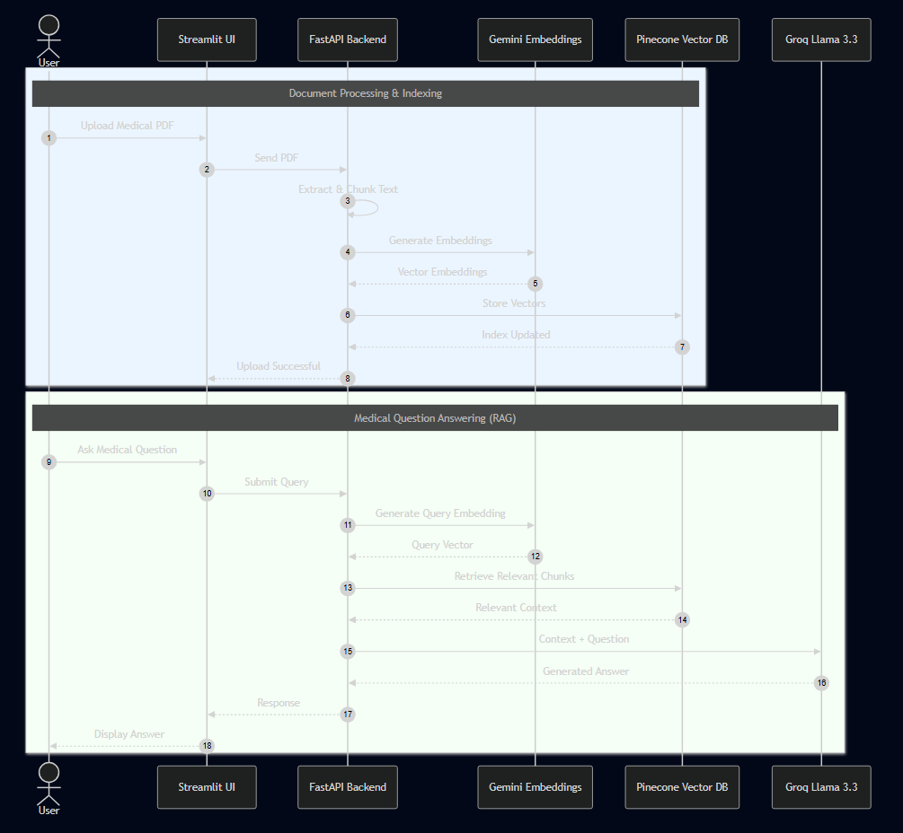
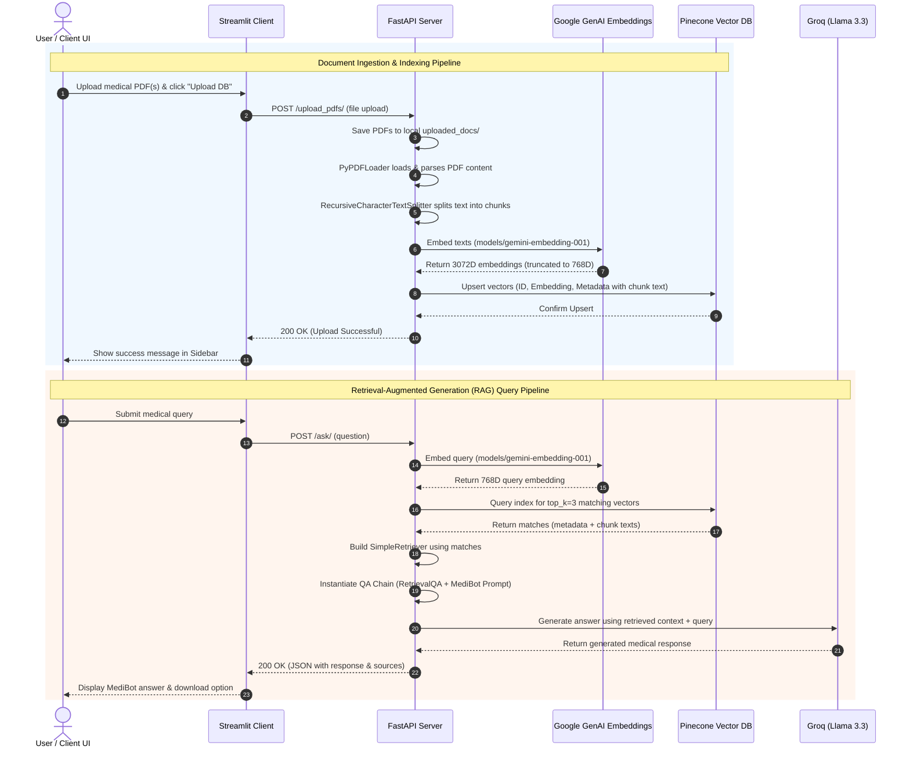

# RAG-Based AI Chat Assistant 

An advanced, production-ready **AI Chatbot** built using **Retrieval-Augmented Generation (RAG)**. This application allows users to upload medical documents (e.g., PDFs, reports, textbooks) which are dynamically chunked, embedded, and indexed into a vector database. Users can then converse with **MediBot**, an AI medical assistant that retrieves relevant context from the uploaded documents to answer medical queries accurately and minimize hallucinations.

---

## 🔄 Project Architecture & Flow





---

## 📁 Directory Structure & File Specifications

```
medicalAssistant/
├── client/                     # Streamlit Frontend
│   ├── components/
│   │   ├── chatUI.py           # Handles conversational interface & chatbot bubbles
│   │   ├── history_download.py # Standardizes and lets users download session chats
│   │   └── upload.py           # Handles PDF upload inputs and buttons
│   ├── utils/
│   │   └── api.py              # Makes network requests to the FastAPI backend
│   ├── app.py                  # Main entry point for Streamlit application
│   ├── config.py               # Holds backend API URL configuration (Local/Render)
│   └── requirements.txt        # Frontend Python dependencies
│
└── server/                     # FastAPI Backend
    ├── middlewares/
    │   └── exception_handlers.py # Catch-all middleware translating internal exceptions into clean JSON responses
    ├── modules/
    │   ├── llm.py              # Configures ChatGroq & RetrievalQA with MediBot prompts
    │   ├── load_vectorstore.py  # Text splitting, vector embedding, & Pinecone ingestion
    │   ├── pdf_handlers.py     # System utilities to save files locally on upload
    │   └── query_handlers.py   # RAG pipeline executor and source extraction formatter
    ├── routes/
    │   ├── ask_question.py     # Router exposing POST /ask/ for RAG Q&A
    │   └── upload_pdfs.py      # Router exposing POST /upload_pdfs/ for indexing
    ├── uploaded_docs/          # Local staging directory for uploaded PDFs
    ├── .env                    # Stored environment secrets & credentials
    ├── logger.py               # Custom logger config with stream handlers
    ├── main.py                 # Core server entrypoint, sets up CORS & Routers
    ├── requirements.txt        # Backend python dependencies
    └── test.py                 # Utility script to test model listing and API key validity
```

### File Specifications

#### Backend (`server/`)

- **`main.py`**: Initializes the FastAPI instance, registers CORS policies, mounts the global exception middleware, and imports/registers backend routers.
- **`logger.py`**: Sets up standard formatting rules and log levels (`INFO`, `DEBUG`, `ERROR`, `CRITICAL`) using standard Python logging.
- **`middlewares/exception_handlers.py`**: Wraps the HTTP pipeline with `try-except` blocks. If an unhandled error occurs, it is logged and converted to a structured `500 Internal Server Error` response.
- **`modules/llm.py`**: Declares LLM specifications. Instantiates the Groq client and configures LangChain's classic `RetrievalQA` module with custom guidelines for the medical assistant (no diagnosis, calm tone, fact-only reliance).
- **`modules/load_vectorstore.py`**: Directs document preprocessing. Chunks PDF data, populates metadata dictionary keys (explicitly writing `page_content` to the `text` attribute), and upserts results into Pinecone.
- **`modules/pdf_handlers.py`**: Utility to save incoming file uploads to the backend server's storage (`uploaded_docs/`).
- **`modules/query_handlers.py`**: Executes LLM chain invocations and formats final output packets containing source documents.
- **`routes/ask_question.py`**: Translates incoming requests into query embeddings, runs Pinecone vector similarities, maps them back into a mock LangChain `BaseRetriever`, and calls the RAG pipeline.
- **`routes/upload_pdfs.py`**: Handles incoming multi-file uploads and feeds them into the database loader.

#### Frontend (`client/`)

- **`app.py`**: Sets up layout defaults and triggers modular component UI renderings.
- **`config.py`**: Simple config switcher allowing seamless routing between localhost and remote deployments.
- **`components/chatUI.py`**: Feeds conversational state into Streamlit message widgets, communicates with API utils, and formats outputs.
- **`components/history_download.py`**: Formats session memory states into downloadable text files.
- **`components/upload.py`**: Sidebar file inputs allowing users to upload PDFs and trigger database updates.

---

## 🛠️ Technical Specifications

### Models Used

1.  **Embedding Model**: `models/gemini-embedding-001` (Google GenAI)
    - _Dimension_: Configured with `output_dimensionality=768` (utilizing Matryoshka representation learning to fit standard Pinecone indices).
2.  **LLM**: `llama-3.3-70b-versatile` (Groq API)
    - _Purpose_: High-performance reasoning model used to synthesize answers based on retrieved document chunks.

### Core Libraries Used

- **`fastapi` & `uvicorn`**: High-performance ASGI framework and web server for the REST API.
- **`streamlit`**: Interactive frontend user interface dashboard.
- **`pinecone-client`**: SDK for indexing and vector similarities matching.
- **`langchain` / `langchain-core` / `langchain-community` / `langchain-classic`**: RAG pipeline orchestration, prompt templates, and legacy retrieval chains.
- **`langchain-google-genai` & `langchain-groq`**: Specialized integration drivers for Google Gemini and Groq model APIs.
- **`python-dotenv`**: Environment variable configurations loading from local `.env` files.
- **`pypdf`**: PDF parsing engine backend.

---

## ⚡ Local Setup Guide

### Prerequisites

- Python 3.10 or 3.11 installed.
- A Pinecone account (with a serverless/pod index created with **768 dimensions** and `dotproduct` metric).
- A Google AI Studio Gemini API Key.
- A Groq Console API Key.

### 1. Configure the Backend (Server)

Navigate to the server directory:

```bash
cd medicalAssistant/server
```

Create a virtual environment and activate it:

```bash
# Windows
python -m venv venv
venv\Scripts\activate

# macOS / Linux
python3 -m venv venv
source venv/bin/activate
```

Install backend dependencies:

```bash
pip install -r requirements.txt
```

Create a `.env` file inside the `server/` directory and configure your keys:

```env
GOOGLE_API_KEY=your_google_api_key_here
GROQ_API_KEY=your_groq_api_key_here
PINECONE_API_KEY=your_pinecone_api_key_here
PINECONE_INDEX_NAME=medicalindex
```

Start the local backend server:

```bash
uvicorn main:app --reload --port 8000
```

The server will start on `http://127.0.0.1:8000`.

### 2. Configure the Frontend (Client)

Open a new terminal window, navigate to the client directory:

```bash
cd medicalAssistant/client
```

Create and activate a separate virtual environment:

```bash
# Windows
python -m venv venv
venv\Scripts\activate

# macOS / Linux
python3 -m venv venv
source venv/bin/activate
```

Install frontend dependencies:

```bash
pip install -r requirements.txt
```

Verify that `client/config.py` is configured to point to localhost:

```python
API_URL = "http://127.0.0.1:8000"
```

Start the Streamlit application:

```bash
streamlit run app.py
```

The UI dashboard will open automatically in your browser at `http://localhost:8501`.

---

## 🌐 Deployment Instructions

### Backend (FastAPI) on Render

1.  Connect your GitHub repository to **Render**.
2.  Create a new **Web Service** pointing to the `medicalAssistant/server` subdirectory.
3.  Choose **Python** runtime environment.
4.  Specify the **Start Command**:
    ```bash
    uvicorn main:app --host 0.0.0.0 --port 10000
    ```
5.  In the Render dashboard, navigate to **Environment** and configure the following variables:
    - `GOOGLE_API_KEY`
    - `GROQ_API_KEY`
    - `PINECONE_API_KEY`
    - `PINECONE_INDEX_NAME`
6.  Deploy the service. Render will expose a public API URL (e.g. `https://your-app-name.onrender.com`).

### Frontend (Streamlit)

1.  Update `client/config.py` to point to your live Render public URL:
    ```python
    API_URL = "https://your-app-name.onrender.com"
    ```
2.  Deploy the client folder to **Streamlit Community Cloud** or any hosting provider.
